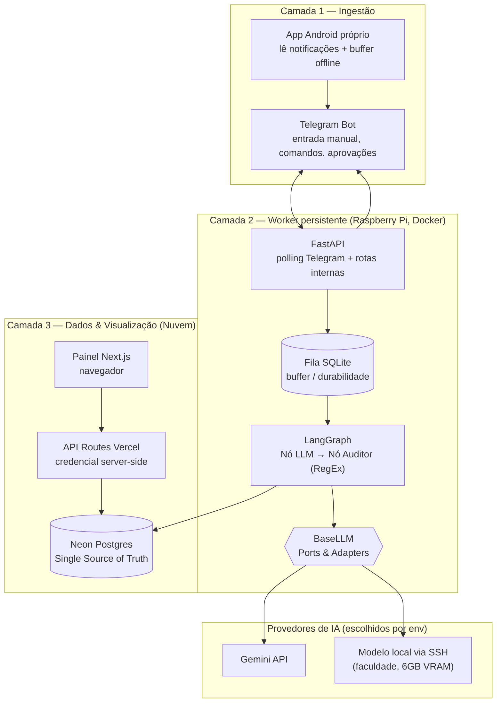

# 01 — Visão & Arquitetura

## 1. Visão Geral
Sistema event-driven de gestão financeira familiar. Transações são capturadas via
notificações móveis (app Android próprio) e entrada manual (Telegram), processadas
por IA (extração + validação) e consolidadas no Neon (Postgres) para visualização
num painel web na Vercel.

## 2. Decisão de Arquitetura — Híbrida (worker persistente + serverless)
> **Por quê:** queremos suportar **dois provedores de LLM desde o início** — Gemini
> (API/nuvem) **e** modelo local via SSH (máquinas da faculdade, 6GB VRAM, ociosas),
> escolhíveis por configuração. O modelo local exige um processo **sempre-ligado**
> (uma função serverless não mantém túnel SSH estável para uma máquina atrás de NAT).
> Por isso o **worker de IA roda no Raspberry Pi**, e não em serverless.

Divisão de responsabilidades:
- **Pi (worker persistente):** polling do Telegram, fila local (SQLite buffer),
  LangGraph (LLM → Auditor), e o adapter `BaseLLM` que roteia para Gemini **ou** local.
  Escreve as transações no Neon e dispara as aprovações pelo Telegram.
- **Neon:** single source of truth (transações confirmadas + todas as entidades).
- **Vercel:** painel Next.js + **API Routes** (credencial do Neon fica server-side;
  o navegador nunca toca o banco direto).

### Seleção de LLM (`BaseLLM` — Ports & Adapters)
Uma env var decide o provedor sem mudar código:
```
LLM_PROVIDER=gemini   # usa GeminiAdapter (API)
LLM_PROVIDER=local    # usa LocalSSHAdapter (SSH → máquina da faculdade)
```
Ambos os adapters existem desde o MVP. Estratégia recomendada: **`gemini` como
padrão** e **`local` como alternativa/fallback** (privacidade e custo zero quando a
máquina da faculdade está disponível). Dá pra evoluir para fallback automático:
tenta local; se a máquina estiver offline, cai pro Gemini.

## 3. Diagrama de Arquitetura



## 4. Stack
| Camada | Tecnologia |
| --- | --- |
| Ingestão | App Android próprio (Kotlin) + Telegram Bot API |
| Worker | Raspberry Pi 3B · Docker · FastAPI (Python 3.11+) · LangGraph |
| Fila | SQLite (`aiosqlite`) local no Pi — buffer e durabilidade |
| IA | `BaseLLM` → `GeminiAdapter` (API) **ou** `LocalSSHAdapter` (SSH), via `LLM_PROVIDER` |
| Dados | Neon (Postgres serverless) + SQLAlchemy 2.0 / Pydantic |
| API | API Routes (Next.js) na Vercel — protege a credencial do Neon |
| Painel | Next.js na Vercel |

## 5. Nota sobre o Pi 3B (1GB RAM)
Roda Docker + FastAPI + SQLite com folga para a carga prevista (poucas transações/dia,
polling de baixa frequência). O **modelo local não roda no Pi** — roda na máquina da
faculdade; o Pi só orquestra a chamada via SSH. Sem gargalo esperado.
