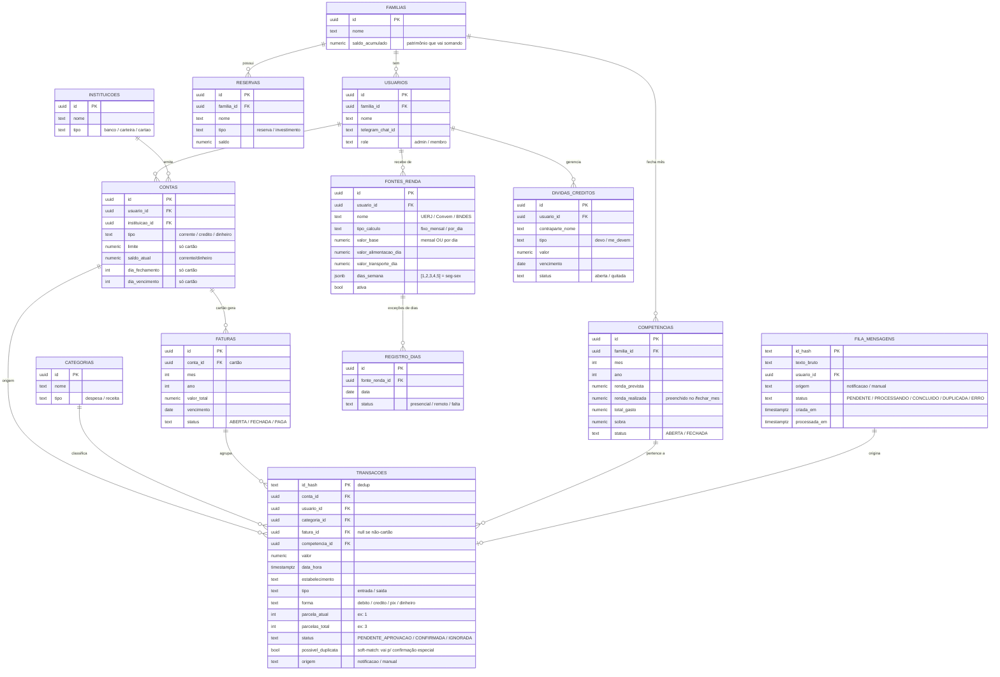

# 02 — Modelo de Dados (Neon / Postgres)

## 1. Diagrama Entidade-Relacionamento

## 2. Notas de modelagem

- **`saldo_acumulado` (família):** cresce com a sobra de cada competência fechada.
  Mover para `RESERVAS` é opcional e manual.
- **Cartão de crédito (modo real):** uma compra no crédito **não** mexe no
  `saldo_atual`. Ela entra como `TRANSACAO (forma=credito)` ligada a uma `FATURA`
  da competência correspondente. O `saldo_atual` só cai quando a fatura é paga
  (`/pagar_fatura` → cria uma transação de saída na conta corrente e marca a fatura `PAGA`).
- **Parcelamento:** uma compra em N vezes gera N transações (ou 1 transação +
  N registros de parcela), cada uma na fatura da sua competência. Assim a IA consegue
  alertar "você já comprometeu R$X dos próximos meses".
- **Renda por dia (BNDES):** `REGISTRO_DIAS` guarda só as **exceções**. O padrão é
  presencial nos `dias_semana` da fonte. `falta` = não ganha nada no dia.
  `remoto` = ganha `valor_base` + `valor_alimentacao_dia`, **sem** `valor_transporte_dia`.
- **Dedup (dois níveis):**
  - `id_hash` (PK de `FILA_MENSAGENS`) = hash do **texto bruto normalizado** →
    detecta a *mesma* notificação reenviada (retry) e descarta automaticamente.
  - **Soft-match** sobre `TRANSACOES` = `(usuario_id + valor + estabelecimento)` dentro
    de uma janela de tempo → marca `possivel_duplicata=true` e manda pra **confirmação
    especial** no Telegram. Nunca descarta uma possível 2ª compra legítima sem perguntar.
