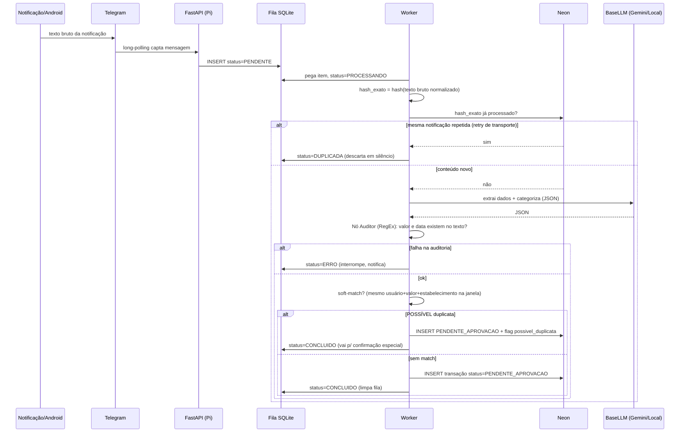
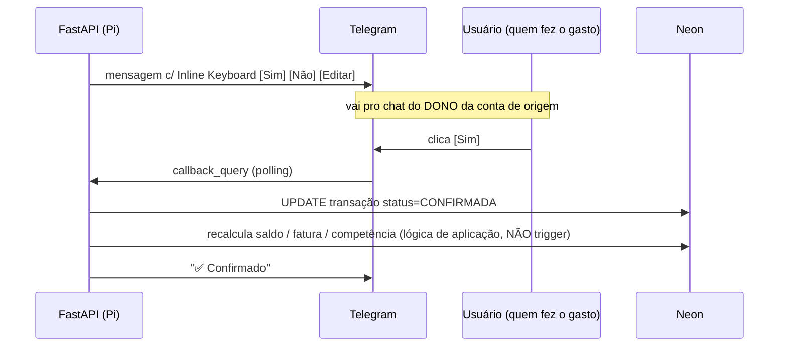
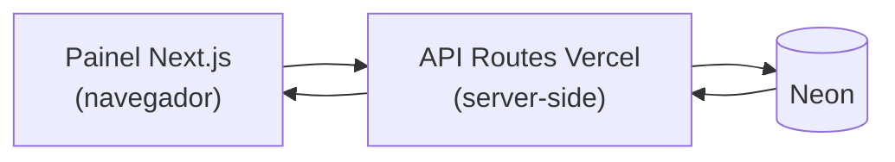

# 03 — Fluxos de Dados (Workflows)

> **⚠️ Atualizado pela refatoração (jun/2026).** O **transporte da notificação** não passa mais pelo
> Telegram: app → HTTPS → API Route na Vercel → **fila no Neon**; o Pi faz polling de saída. Telegram
> fica só para **confirmações/comandos/entrada manual**. Não há **trigger** no banco — recálculo de
> saldo/fatura/competência é **lógica de aplicação** (ver Fluxo C, corrigido abaixo). Fonte da
> verdade: **`docs/06-arquitetura-alvo.md`**.

## Fluxo A+B — Ingestão, Deduplicação e Processamento

> **Dois níveis de dedup:**
> - **Duplicata exata** (a *mesma* notificação chegou 2× por retry do app/Telegram) →
>   descartada automaticamente, sem incomodar.
> - **Possível duplicata semântica** (mesmo usuário + valor + estabelecimento dentro de
>   uma janela de tempo) → **nunca descarta sozinha**: cria a transação marcada
>   (`possivel_duplicata`) e manda pra confirmação especial no Telegram, porque pode ser
>   uma 2ª compra legítima igual. Você decide: "é a mesma" (ignora) ou "é nova" (confirma).

## Fluxo C — Confirmação Human-in-the-Loop

> `[Não]` → status `IGNORADA`. `[Editar]` → abre lançamento manual guiado para corrigir
> valor/categoria/conta.
>
> **Variante — possível duplicata:** quando a transação vem com `possivel_duplicata`,
> a mensagem é diferente: *"⚠️ Parece repetida (R$X em Y, igual à de HH:MM). É a mesma ou
> uma nova compra?"* com botões `[É a mesma → ignorar]` `[É nova → confirmar]`.

## Fluxo D — Painel (Vercel)

Gráficos, evolução do saldo acumulado, tabela com edição de transações, cadastro de
bancos/contas/categorias, config de fontes de renda. **Nunca** conecta no Postgres
direto do navegador.

## Fluxo E — Renda por dias (caso BNDES)
1. Padrão: cada dia em `dias_semana` da fonte conta como **presencial** (ganha
   `valor_base` + alimentação + transporte).
2. Exceções registradas pelo usuário:
   - `/faltei [data]` → `REGISTRO_DIAS.status=falta` → ganha **0** no dia.
   - dia **remoto** → `status=remoto` → ganha `valor_base` + alimentação, **sem** transporte.
3. A renda **prevista** da competência é calculada somando todas as fontes
   (fixas + por-dia conforme os registros).

## Fluxo F — Fechamento mensal (`/fechar_mes`)
1. Usuário informa quanto **recebeu de fato** de cada fonte.
2. Sistema compara **previsto × recebido** e aponta inconsistências (ex: BNDES pagou
   menos dias do que o registrado).
3. Calcula a **sobra** (renda realizada − total gasto) e soma ao `saldo_acumulado`
   da família. Competência vira `FECHADA`.
4. Gera relatório: renda por fonte, dias trabalhados/faltados/remotos, gastos por categoria.

## Comandos do Bot (escopo proposto)
`/saldo` · `/giro` · `/cartao` · `/limite` · `/gastos [categoria]` · `/relatorio`
`/lancar` · `/faltei` · `/fechar_mes` · `/pagar_fatura` · `/divida` · `/pendentes` · `/desfazer`

---

## ✅ Decisões (antes em aberto)
1. **Dedup:** dois níveis (ver Fluxo A+B). Duplicata exata = descarte automático;
   possível duplicata semântica = **sempre** vai pra confirmação especial no Telegram.
   Nunca se descarta uma possível 2ª compra legítima sem perguntar.
2. **Conta conjunta:** fora de escopo. Aprovação sempre vai pra **quem fez o gasto**.
3. **Categorias (lista autorizada):** Alimentação · Mercado · Transporte · Moradia ·
   Saúde · Educação · Lazer · Assinaturas · Vestuário · Lanche na rua · Presentes ·
   Transferências · Investimentos/Reserva · Outros.
