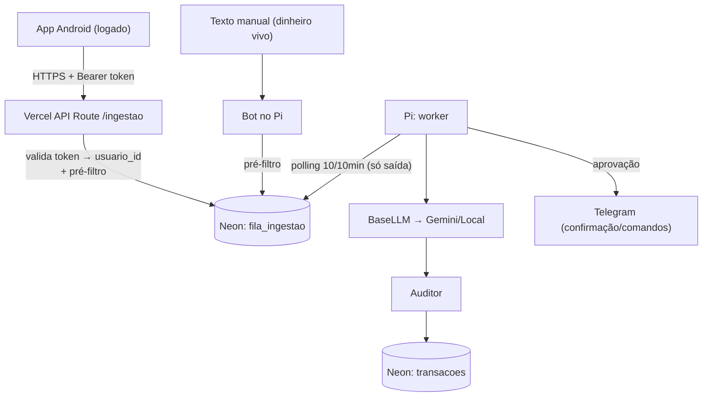

# 06 — Arquitetura-alvo (refatoração)

> Documento vivo, construído em **chunks**. Cada chunk fecha um pedaço coerente do desenho
> antes de ir pro código. Substitui pontos divergentes dos docs 01/03 (reconciliação final na
> task #11). Defeitos referenciados estão em `docs/05-analise-critica-arquitetura.md`.
>
> Decisões transversais já fechadas: Pi definitivo nesta fase; SSH→Ollama fora do PRD; LLM
> isolado atrás de `BaseLLM` (migração futura p/ HTTP API = trocar 1 adapter).

---

## Chunk A — Ingestão ✅ (tasks #1, #2, #4; adianta parte de #5 e #7)

### A.0 Princípio
**Dois coletores, um pipeline, fila no Neon, Pi outbound-only.** As fontes de evento são
desacopladas, mas convergem para uma **fila única no Neon** antes de qualquer processamento caro
(LLM). O Pi **só faz conexões de saída** — nunca recebe conexão de fora, então não precisa de
porta exposta, túnel nem VPN. Identidade vem sempre de **token verificado**, nunca do corpo.

### A.1 Coletores
- **Coletor App (primário):** app **logado** → `POST /ingestao` na **Vercel** com `Authorization:
  Bearer <token>`. A Vercel valida o token, **deriva o `usuario_id` do token** (não do corpo),
  roda o pré-filtro e faz `INSERT` em `fila_ingestao` no Neon. **O app nunca toca o Neon direto.**
- **Coletor Manual (Telegram):** você digita um gasto (ex.: dinheiro vivo) no bot → o bot (no Pi)
  roda o pré-filtro leve e faz `INSERT` na **mesma** `fila_ingestao`. Mesmo pipeline.
- **Telegram = confirmação/aprovação + comandos + entrada manual.** **Não** transporta a
  notificação automática do banco (supera o transporte dos docs 01 §2 e Fluxo A do doc 03).

### A.2 Fila no Neon + worker outbound-only (adianta task #5)
- `fila_ingestao` (tabela no Neon) **é a fila**: durável e já parte da fonte da verdade. Substitui
  a fila SQLite no Pi → **mata o defeito C4** (dois processos disputando o SQLite) e o A3.
- O Pi faz **polling de 10 em 10 min**: pega itens `PENDENTE`, claim atômico
  (`UPDATE ... SET status='PROCESSANDO' ... RETURNING`), processa e marca o resultado.
- Como é só saída, o Pi atrás de NAT **não precisa de Tailscale, túnel nem porta aberta**.
- Claim/retry/DLQ/reaper detalhados → **task #9**. Schema da tabela → na implementação.

### A.3 Autenticação e identidade (adianta task #7)
- **Neon Auth** como store de usuários: os usuários vivem **no próprio Neon**, com `JOIN`/FK direto
  na tabela de domínio `usuarios` (família, role). Sem segurança caseira (sem hash/JWT na mão).
- **Cadastro/login na Vercel**; o app loga com a **mesma conta** (identidade única app + painel).
- Após o login, o backend emite um **token de dispositivo** (escopo do aparelho, ligado ao
  `usuario_id`), guardado no **Android Keystore**. Todo POST do app leva esse Bearer.
- A Vercel **deriva o `usuario_id` do token** → corrige S1 (ingestão sem auth) e S3 (confiar no
  `usuario_id` do corpo).
- O **cadastro é a porta do onboarding** (task #8): cria família → usuário → contas/cartões/renda
  + o mapa `package→conta`.

### A.4 Contrato de payload (task #2)
Campos **formatados/separados** (não um blob cru) — baratear extração e habilitar o pré-filtro.
A identidade **não** está no corpo (vem do token):

| Campo | Tipo | Uso |
|---|---|---|
| `package_name` | str | app de origem → resolve a conta (Chunk B) |
| `title` | str? | título da notificação |
| `text` | str? | corpo da notificação |
| `posted_at` | int (ms) | **vira `data_hora`** (UTC tz-aware), não a hora de chegada |
| `latitude`/`longitude` | float? | best-effort (backlog: contexto da compra) |
| `client_msg_id` | str | idempotência de transporte (retry do POST) |
| `app_version` | str | diagnóstico |

> Auth via **Bearer token** no header (não HMAC no corpo) — o token substitui a assinatura.

Regras:
- **`data_hora` = `posted_at`** convertido para timestamptz (corrige A5: hoje usa a hora de
  chegada, errada quando o app bufferiza offline). Timezone consistente em todo o pipeline.
- **Dedup exato:** o `hash_exato` é **calculado no servidor** a partir do texto normalizado e
  gravado na linha da fila; o worker confere contra `transacoes`. `client_msg_id` serve só de
  idempotência de transporte, não vira o id de negócio.

### A.5 Pré-filtro sem IA (task #4)
Roda **na borda de ingestão** (na Vercel para o app; no bot para o manual), **antes de enfileirar**
— barra não-transações de graça (defeito C3):
1. **`package_name` mapeado** como app de banco/carteira desse usuário? (mapa no Neon — Chunk B).
   Se não → descarta (não é notificação financeira). A Vercel tem acesso ao Neon para checar.
2. **Tem valor monetário no texto?** Reusar `_extrair_decimais_do_texto` do auditor. Sem token
   monetário → descarta.
3. (Opcional, conservador) pistas de intenção (`compra`, `pix`, `débito`…) — só se não aumentar
   falso-negativo; na dúvida, deixa passar.

Só o que passa vira linha em `fila_ingestao`. Entrada manual passa pelos mesmos filtros (o package
é dispensado, já que é lançamento explícito).

### A.6 O que este chunk fecha
- **C2** (caminho duplicado) → dois coletores convergem em `fila_ingestao`.
- **C3** (todo texto vira transação) → pré-filtro antes do LLM.
- **C4** (SQLite multiprocesso no Pi) → fila no Neon, Pi outbound-only.
- **A5** (data errada) → `posted_at` + timezone consistente.
- **S1/S3** (parcial) → identidade por token; detalhe e rotação na task #7.
- Adianta a task #5 (fila no Neon) e a task #7 (auth/identidade).
- Supera o transporte dos docs 01/03 (reconciliar na task #11).

### A.7 Pendências empurradas adiante
- Mapa `package_name → conta_id` e amarração de fatura/competência → **Chunk B (task #3)**.
- Claim/retry/DLQ/reaper da `fila_ingestao` e schema da tabela → **task #9 / implementação**.
- Detalhe fino de auth (escopos, refresh, rotação de segredos) → **task #7**.
- Onboarding completo (contas/cartões/renda) a partir do cadastro → **task #8**.

---

## Chunk B — Conta, classificação e amarração fatura/competência ✅ (task #3; adianta #10)

### B.0 Modelo de conta
- **1 app = 1 conta = 1 banco.** A conta **carrega o saldo (corrente) e o cartão de crédito** do
  mesmo banco — é uma entidade só. `package_name → conta` (1:1 por usuário), cadastrado no
  onboarding.
- *Nota de schema:* hoje `contas.tipo` separa `corrente`/`credito`/`dinheiro` em linhas distintas;
  o modelo-alvo é **uma conta por banco com saldo + dados de cartão** (limite, dia_fechamento,
  dia_vencimento) na mesma entidade. A forma final da tabela sai junto com a persistência (task #6).

### B.1 Classificação débito × crédito — regex confirma a IA (adianta task #10)
- A IA continua extraindo `forma`, **mas um regex determinístico** sobre o texto classifica
  débito/crédito/pix (ex.: "crédito", "compra no crédito", "fatura" × "débito", "Pix", "saque").
- O regex **confirma** a IA — anti-alucinação, igual ao auditor já faz com o valor. Divergência
  IA×regex → falha de auditoria → vira feedback de reflexão. Estende o auditor (que hoje só valida
  valor) → **task #10**.
- Vantagem: a decisão que mexe no saldo (crédito **não** debita) **não depende** de a IA acertar a
  forma — sai de regra determinística.

### B.2 Resolução e amarração (resolve C1, P2, P3)
- **Na ingestão (ao salvar):** resolve `conta_id` pelo `package_name`; classifica a forma (regex).
  A mensagem de aprovação já mostra "Banco · cartão/conta". **A conta nunca mais fica nula → fim do
  defeito C1.**
- **Na confirmação (✅):**
  - **crédito:** anexa à **fatura aberta** do cartão da conta — acha/cria pela competência usando
    `dia_fechamento` (compra após o fechamento → fatura do mês seguinte). **Não mexe no saldo.**
  - **débito/pix/dinheiro:** debita/credita o `saldo_atual` da conta.
  - Em ambos: anexa à **competência** (família, mês, ano) — acha/cria.
- Idempotente (confirmar 2× não debita 2×) — já garantido em `ServicoTransacoes`.

### B.3 App não mapeado
- O pré-filtro (Chunk A) já descarta `package_name` não mapeado. Melhoria opcional: nudge no
  Telegram "notificação de um app não cadastrado (X) — quer cadastrar?" para completar o
  onboarding (task #8).

### B.4 O que este chunk fecha
- **C1** (conta nula → confirmar quebra), **P2** (notificação→conta), **P3** (fatura/competência
  não amarradas).
- Estende o auditor para a **forma** → adianta a task #10.
- Empurra a forma final da tabela `contas` para a persistência (task #6).

---

## Chunk C — Execução no Pi ✅ (task #5)

### C.0 Decisões
- **Daemons sempre-ligados em Docker** (mantém o setup atual; há RAM de sobra — ~metade livre).
  Cron foi descartado: simplicidade vale mais que economia de RAM aqui.
- **Dois processos (opção b)**, conversando **só pelo Neon**, para o LLM nunca travar o bot:
  - **Worker daemon:** polling do Neon de 10/10min → claim do item → dedup exato → LLM → auditor
    (valor + forma) → grava a transação → **envia** a aprovação ao Telegram (sendMessage outbound).
  - **Bot daemon:** polling do Telegram de 10/10min → trata callbacks (confirma/ignora), comandos
    de consulta e **entrada manual** (dinheiro vivo) → enfileira o manual na `fila_ingestao`.
- **Cadência:** ambos 10/10min. Nada é real-time; atraso de até ~1 dia é tolerável.
- **Direções no Telegram separadas:** o worker **envia** aprovações (chamada outbound, dispensa o
  loop do bot); o bot **recebe** callbacks/comandos/manual (precisa do polling). Sem acoplamento.

### C.1 Cortes de RAM
- Ingestão **fora do Pi** (vai pra Vercel) → somem FastAPI/uvicorn. *(maior ganho)*
- **Lazy-import do SDK do Gemini** → só carrega no caminho Gemini; o caminho local (SSH) não puxa
  SDK pesado.
- *(Opcional, marginal)* trocar SQLAlchemy ORM por psycopg v3 puro no worker → fica na task #6.
- Docker mantido (RAM sobra).

### C.2 Fecha / empurra
- Fecha **A3** (LLM inline travando o bot) — o LLM agora vive no worker, isolado.
- LLM atrás de `BaseLLM`: quando virar HTTP API, troca 1 adapter (fora do PRD).
- **Resiliência da fila** (claim/reaper/retry/DLQ) → **task #9 (Chunk D)**.

---

## Chunk D — Segurança detalhada (#7) + resiliência da fila (#9) ✅

### D.1 Resiliência da fila (task #9)
- **Estados:** `PENDENTE → PROCESSANDO → CONCLUIDO | DUPLICADA | ERRO`.
- **Claim atômico:** `UPDATE ... SET status='PROCESSANDO', claimed_em=now() ... RETURNING` — um
  item por vez, nunca dois workers no mesmo.
- **Reaper:** itens presos em `PROCESSANDO` há **> 30 min** (crash no meio) voltam para `PENDENTE`
  e incrementam `tentativas`. *(visibility timeout = 30 min)*
- **DLQ:** após **5 tentativas**, o item vai para `ERRO` (dead-letter) **e dispara aviso no
  Telegram** — não gira pra sempre nem some calado.
- **Idempotência (não conta 2×):** `id_hash` PK + `INSERT ON CONFLICT DO NOTHING` + confirmar
  idempotente. *(já resolvido)*
- **Retry de fila (infra) ≠ retry de reflexão** (3 tentativas de LLM por provider, task #10).

### D.2 Segurança e identidade (task #7)
- **Vercel** valida o Bearer token → deriva `usuario_id` → confirma que o `package_name` pertence
  a esse usuário **antes** de enfileirar. Limite de tamanho de payload.
- **Rate limit:** a Vercel é serverless (sem estado entre invocações), então rate-limit ingênuo não
  se aplica; fica **opcional** via store externo (Vercel KV/Upstash) se necessário. O token já
  limita o abuso a usuários autenticados.
- **Token de dispositivo:** emitido no login, guardado no **Android Keystore**, **revogável** —
  exige uma **tela de "aparelhos conectados"** no painel/app.
- **Segredos server-side:** credencial do Neon só na Vercel e no worker do Pi; **nunca no app**.

### D.3 Checklist de rotação de segredos (ação do usuário — deferida)
> O usuário rotaciona **depois**. Lembrete (S2):
- [ ] Token do bot — @BotFather `/revoke`
- [ ] Connection string do Neon — recriar/rotacionar
- [ ] Chave do Gemini
- [ ] Senha SSH/VPN da faculdade

### D.4 O que este chunk fecha
- **S1** (auth na ingestão), **S2** (rotação planejada), **S3** (identidade por token).
- **O1** (DLQ + aviso) e **O2** (reaper de `PROCESSANDO` órfão).
</content>
