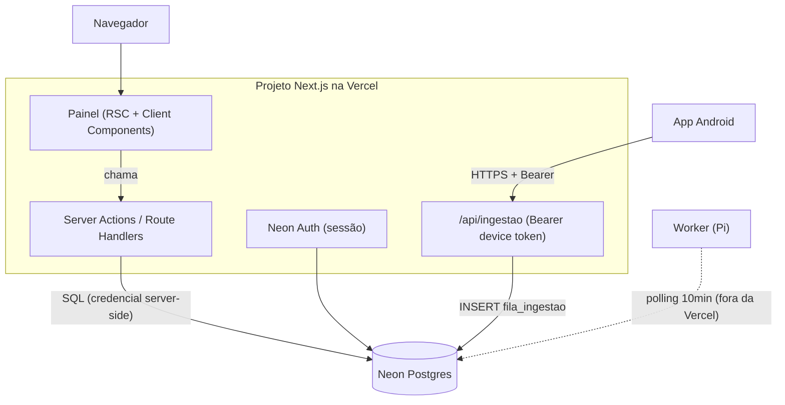

# 07 — Painel Web (spec técnico + prompts para o Stitch)

> Objetivo deste doc: (1) descrever a **stack** e **como tudo se conecta**, e (2) entregar um
> **prompt pronto pra colar no Stitch por página**. O app Android fica com outro agente; aqui é só
> o painel web (Next.js na Vercel). O painel **e** o endpoint de ingestão vivem no **mesmo projeto
> Next.js** (ver `docs/06` — Chunk A).

---

# Parte 1 — Visão, stack e conexões

## 1.1 Propósito
Painel de **finanças da família**: ver pra onde o dinheiro vai, **aprovar/corrigir** as transações
capturadas pelo app, configurar contas/cartões/renda e **fechar o mês**. Usuários: você e a esposa
(família). Idioma **PT-BR**, moeda **BRL**. Não é banco corporativo frio nem startup barulhenta —
é um **livro-caixa caloroso e preciso**.

## 1.2 Stack
| Camada | Tecnologia | Por quê |
|---|---|---|
| Framework | **Next.js 15 (App Router) + React + TypeScript** | RSC + Server Actions; mesmo projeto serve UI + API |
| Estilo | **Tailwind CSS v4** + **shadcn/ui** | base de componentes acessível; combina com o output do Stitch |
| Auth | **Neon Auth** (Stack Auth) | usuários vivem no Neon; sessão no painel + token de dispositivo p/ o app |
| Dados | **`@neondatabase/serverless`** (driver JS), em Server Actions/Route Handlers | credencial **server-side**; navegador nunca toca o Neon |
| Gráficos | **Recharts** | leve, declarativo |
| Forms | **react-hook-form + zod** | validação tipada |
| Hosting | **Vercel** | serverless; mesmo deploy do `/api/ingestao` |

## 1.3 Como tudo se conecta

Regras de ouro:
- **O navegador nunca conecta no Neon.** Todo acesso passa por Server Action/Route Handler.
- **Identidade vem da sessão (Neon Auth)** no painel, e do **token de dispositivo** em `/api/ingestao`
  — nunca do corpo (ver `docs/06` D.2).
- O **worker do Pi não faz parte deste app**; ele só lê/escreve o mesmo Neon por fora.

## 1.4 Design system (cole no topo de TODO prompt do Stitch — seção 4.0)
**Conceito:** livro-caixa caloroso — calmo, preciso, confiável, com um quê humano e "fluido".
Fugir dos 3 clichês de IA (creme+serifa+terracota; preto+verde-ácido; jornal de fios finos).

**Paleta (light, padrão):**
- `paper` (fundo) `#F6F7F5` · `surface` (cards) `#FFFFFF` · `line` (bordas hairline) `#E4E6E2`
- `ink` (texto) `#16201C` · `muted` (texto secundário) `#6B736E`
- `brand` (ações/marca) `#1E6F5C` · `brand-soft` (tint) `#DDEDE7`
- `entrada` (receita) `#2E8B6F` · `saida` (despesa) `#C0493D` · `alerta` (fatura/pendência) `#C8852E`

**Tipografia:**
- Display/títulos/números grandes: **Bricolage Grotesque** (600/700) — dá a personalidade fluida.
- Corpo/UI: **Inter** (400/500/600).
- **Valores monetários e dados tabulares: fonte mono com algarismos tabulares** (Geist Mono ou
  JetBrains Mono), **alinhados à direita**, pra colunas baterem. **Esta é a assinatura visual.**

**Layout:** app shell com **sidebar à esquerda no desktop** que vira **tab bar inferior no mobile**.
Cantos arredondados 12–16px, sombras suaves, grid de 8px, respiro generoso. Responsivo até mobile,
foco de teclado visível, `prefers-reduced-motion` respeitado.

**Assinatura:** (1) valores em mono tabular alinhados; (2) cada **categoria tem uma cor-chip**;
(3) o **saldo acumulado** aparece como uma **linha de área "que respira"** (sparkline fluida), calma
— **não** um número gigante com gradiente.

**Tom de voz:** PT-BR, sentence case, voz ativa, direto. Um botão diz o que faz ("Confirmar",
"Pagar fatura"); o nome se mantém no fluxo todo. Estados vazios convidam à ação; erros explicam o
que fazer, sem pedir desculpas. (Opcional: variante dark, reaproveitando os mesmos papéis de cor.)

---

# Parte 2 — Páginas (prompts prontos pro Stitch)

> Cada página tem: **Prompt** (cola no Stitch, já com o conceito), **Dados & conexão** (o que lê/grava
> e onde) e **Estados** (vazio/erro/carregando). Comece o prompt do Stitch com a seção 4.0.

## P1 — Login / Cadastro  (`/login`, `/signup`)
**Prompt:** Tela de entrada dividida em duas: à esquerda um painel `brand` (#1E6F5C) com o nome
"carteirAI" em Bricolage Grotesque e uma frase curta ("As contas da família, no mesmo lugar."), e
um pequeno gráfico de linha decorativo "respirando" ao fundo. À direita, num `surface` branco,
o formulário: campos e-mail e senha, botão primário "Entrar", link "Criar conta da família".
No cadastro, mesmos campos + "Nome da família". Inputs com label flutuante, foco em `brand`.
Mobile: o painel da esquerda vira um cabeçalho compacto no topo. Mensagens de erro abaixo do campo,
em `saida`, explicando como corrigir.
**Dados & conexão:** componentes de auth do **Neon Auth**; ao criar conta, cria a `familia` + o
`usuario` (role admin). Sessão guardada pelo Neon Auth.
**Estados:** erro de credencial inline; loading no botão.

## P2 — Onboarding (wizard)  (`/onboarding`)
**Prompt:** Assistente em passos com uma barra de progresso fina no topo (sem "01/02/03"
decorativo — só os passos reais). Passos:
1. **Família & membros** — adicionar membros (nome; opcional: chat do Telegram). Cartões de membro
   com avatar de iniciais.
2. **Contas/Bancos** — para cada banco: nome, **app de origem (package)**, tem **conta** (saldo
   inicial)? tem **cartão** (limite, dia de fechamento, dia de vencimento)? Lista crescente de
   cartões-de-banco adicionados, cada um num card com chip do tipo.
3. **Fontes de renda** — adicionar fonte: nome, tipo (**fixo mensal** ou **por dia**). Se por dia:
   valor/dia, alimentação/dia, transporte/dia e os **dias da semana** (toggles seg–dom).
4. **Dívidas (opcional)** — contraparte, valor, vencimento, devo/me devem.
5. **Revisão** — resumo de tudo + botão "Concluir e ir pro painel".
Navegação "Voltar"/"Continuar" fixa no rodapé. Cada passo salva ao avançar.
**Dados & conexão:** Server Actions gravando em `usuarios`, `contas` (com `package_name` + saldo +
campos de cartão), `fontes_renda` (+ `dias_semana`), `dividas_creditos`. É a porta do onboarding
(`docs/06` A.3).
**Estados:** validação por passo (zod); permite pular dívidas; resumo editável.

## P3 — Dashboard / Visão geral  (`/`)
**Prompt:** Topo com saudação curta e o **mês corrente**. Herói **calmo**: o **saldo acumulado da
família** como uma **linha de área que respira** (Recharts), com o valor atual em mono tabular ao
lado — sem número gigante com gradiente. Abaixo, uma faixa de **3–4 cartões-resumo**: Saldo de giro
do mês, Total gasto no mês, Faturas em aberto (com a mais próxima de vencer destacada em `alerta`),
e Pendências de aprovação (com contador). Depois, dois blocos lado a lado: **Gastos por categoria**
(barras horizontais, cada uma com a cor-chip da categoria) e **Últimas transações** (lista compacta,
valor em mono alinhado à direita, `entrada` verde / `saida` vermelho). Card de "Pendências" leva pra
P4. Mobile: tudo empilha; herói primeiro.
**Dados & conexão:** Server Actions agregando de `transacoes` (status CONFIRMADA, mês corrente),
`familias.saldo_acumulado`, `faturas` (ABERTA), contagem de `PENDENTE_APROVACAO`.
**Estados:** vazio ("Ainda sem transações — assim que o app capturar a primeira, ela aparece aqui.");
loading com skeletons; erro com retry.

## P4 — Transações  (`/transacoes`)
**Prompt:** Tela de tabela densa mas legível. Barra de filtros no topo: período, conta, categoria,
status, busca por estabelecimento. **Aba/realce "Pendentes"** primeiro (as que aguardam aprovação),
com botões **Confirmar** / **Ignorar** inline; itens marcados como **possível duplicata** ganham um
selo `alerta` e o texto "Parece repetida". A tabela: data, estabelecimento, categoria (cor-chip),
conta, forma, e **valor em mono tabular alinhado à direita** (verde/vermelho por tipo). Clique numa
linha abre um **painel lateral de edição** (valor, categoria, conta, forma) com "Salvar". Paginação
ou scroll infinito.
**Dados & conexão:** lê `transacoes` (JOIN categorias/contas); ações de **confirmar/ignorar/editar**
chamam Server Actions que disparam a regra de saldo/fatura (`docs/06` B.2). Edição = correção manual.
**Estados:** vazio por filtro; confirmação otimista com rollback em erro; toast "Confirmado".

## P5 — Cartões & Faturas  (`/cartoes`)
**Prompt:** Grid de **cartões** (um card por cartão, com nome do banco, limite, limite usado como
barra de progresso, dia de fechamento/vencimento). Ao abrir um cartão: a **fatura aberta** atual
(itens que a compõem, total em mono, data de vencimento em `alerta` se próxima) e histórico de
faturas (ABERTA/FECHADA/PAGA). Botão **Pagar fatura** (abre confirmação: de qual conta sai o
pagamento). 
**Dados & conexão:** `contas` (tipo cartão), `faturas`, `transacoes` (forma=credito, da fatura).
"Pagar fatura" → Server Action que marca fatura PAGA e debita o saldo da conta escolhida.
**Estados:** sem cartão ("Cadastre um cartão em Configurações."); fatura vazia; loading.

## P6 — Renda & Fechar mês  (`/renda`)
**Prompt:** Duas seções. **Fontes de renda:** lista com tipo (fixo/por dia) e valores; para fontes
por dia, um **calendário do mês** onde cada dia útil é presencial por padrão e pode virar **remoto**
(ganha base+alimentação, sem transporte) ou **falta** (ganha 0) — cores distintas e legenda.
**Fechar mês:** painel comparando **previsto × recebido por fonte** (inputs pro recebido real), com
destaque quando divergir (ex.: BNDES pagou menos dias). Resumo da **sobra** (renda realizada −
gasto) que vai pro saldo acumulado. Botão "Fechar competência".
**Dados & conexão:** `fontes_renda`, `registro_dias` (presencial/remoto/falta), `competencias`.
O previsto é **recalculado na hora** a partir de RENDA (decisão D15). Fechar → grava
`renda_realizada`, `sobra`, status FECHADA, soma à `familias.saldo_acumulado`.
**Estados:** mês sem fontes; aviso antes de fechar (ação irreversível); loading.

## P7 — Relatórios  (`/relatorios`)
**Prompt:** Relatório mensal limpo, "imprimível": renda por fonte, dias trabalhados/remotos/faltados,
gastos por categoria (donut + tabela), evolução do saldo acumulado (linha). Seletor de mês no topo.
Tom de leitura, bastante respiro, números em mono tabular.
**Dados & conexão:** agrega `competencias`, `transacoes`, `registro_dias` do mês escolhido.
**Estados:** mês sem dados; export opcional (PDF/print) como melhoria futura.

## P8 — Configurações  (`/config`)
**Prompt:** Abas: **Contas & cartões** (CRUD, incluindo o **mapa app→conta** via `package_name`),
**Categorias** (lista das 15 com cor-chip editável), **Fontes de renda** (CRUD), **Família/membros**.
Layout de formulário calmo, cada item num card.
**Dados & conexão:** CRUD em `contas`, `categorias`, `fontes_renda`, `usuarios`.
**Estados:** confirmação ao excluir; validação inline.

## P9 — Aparelhos conectados  (`/config/aparelhos`)
**Prompt:** Lista de dispositivos que enviam notificações: nome do aparelho, último envio, status.
Botão **Revogar acesso** por aparelho (confirmação). Texto explicando que revogar bloqueia o envio
daquele celular.
**Dados & conexão:** tokens de dispositivo (Neon Auth / tabela de devices). Revogar invalida o token
(`docs/06` D.2).
**Estados:** nenhum aparelho ("Conecte o app fazendo login nele."); confirmação ao revogar.

---

# Parte 3 — Componentes compartilhados
- **AppShell**: sidebar (desktop) / tab bar (mobile) com itens: Visão geral, Transações, Cartões,
  Renda, Relatórios, Config. Cabeçalho com nome da família + menu da conta (sair).
- **Money**: renderiza valor em **mono tabular**, alinhado à direita, cor por `tipo`
  (entrada/saida), formato BRL `R$ 1.234,56`.
- **CategoryChip**: bolinha de cor + nome da categoria (cores em Config).
- **StatCard**: título, valor (Money), e variação/legenda opcional.
- **EmptyState / ErrorState**: ilustração leve + texto-direção + ação.
- **ConfirmDialog**: para ações irreversíveis (pagar fatura, fechar mês, revogar, excluir).

# Parte 4 — Convenções globais (repetir no Stitch)
- **4.0 (cabeçalho de todo prompt):** colar o **Design system (1.4)** — paleta, tipos, layout,
  assinatura, tom.
- Tudo **responsivo** (desktop → mobile), acessível (foco visível, contraste AA), `reduced-motion`.
- Números **sempre** em mono tabular alinhados à direita. Datas em PT-BR. Moeda BRL.
- Sem clichês de dashboard: nada de número-gigante-com-gradiente como herói; herói = linha que respira.
</content>
